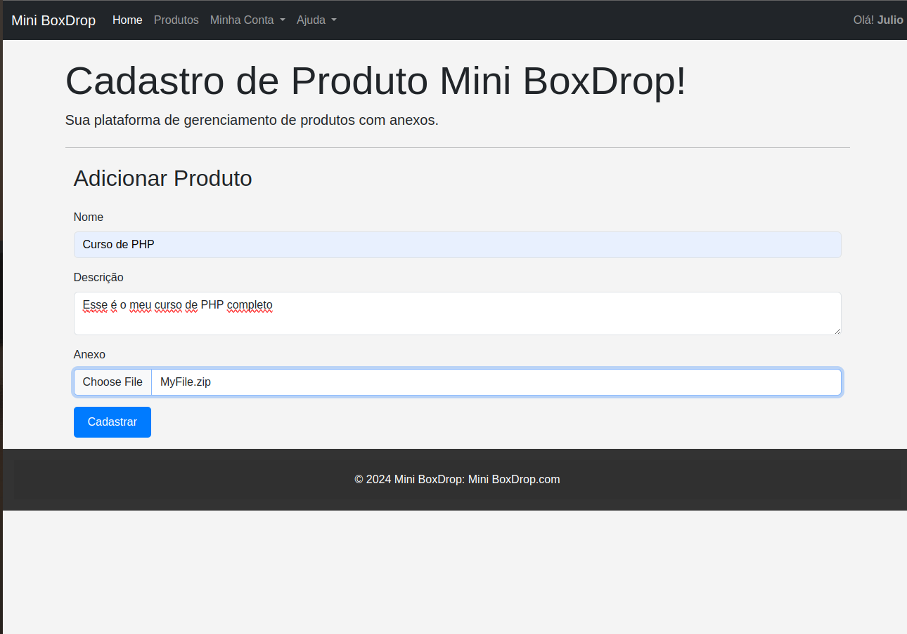
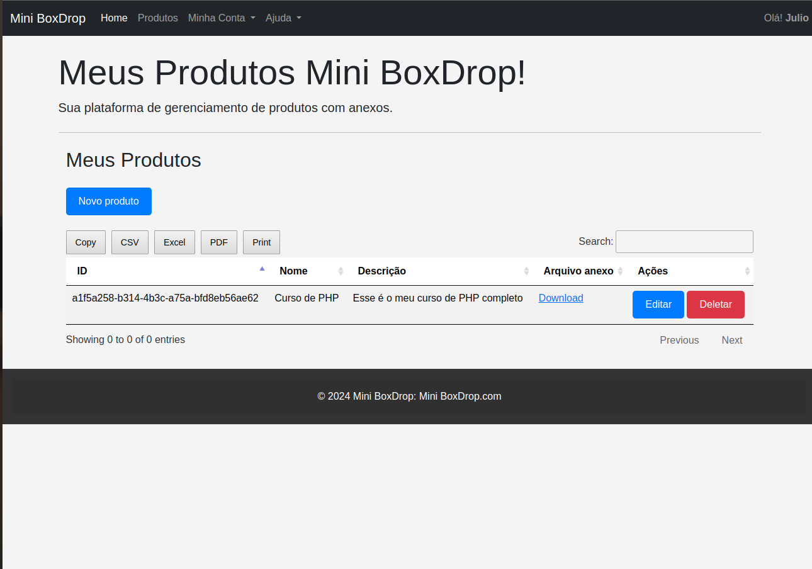
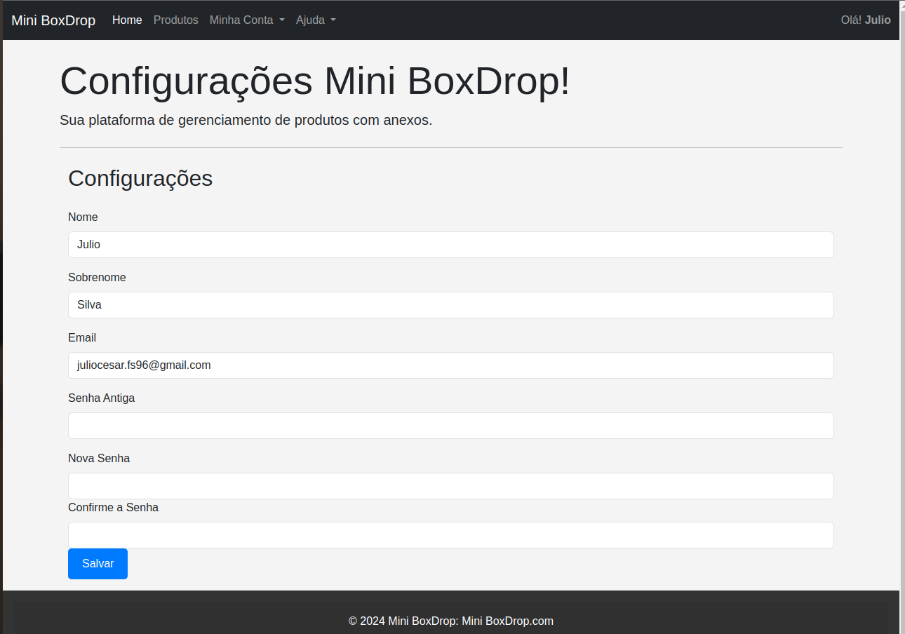
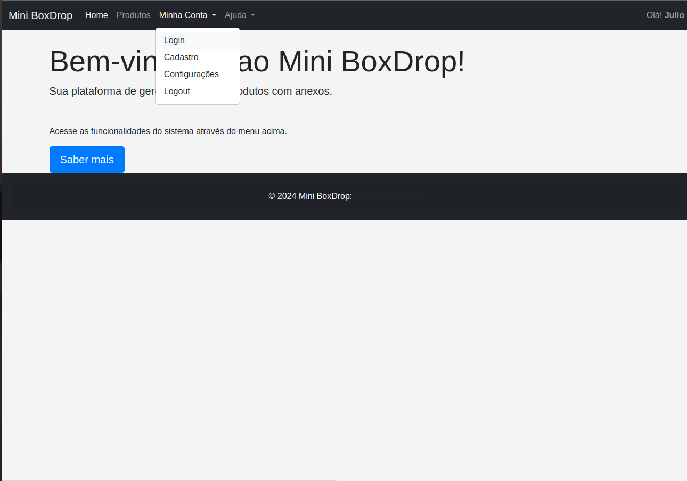
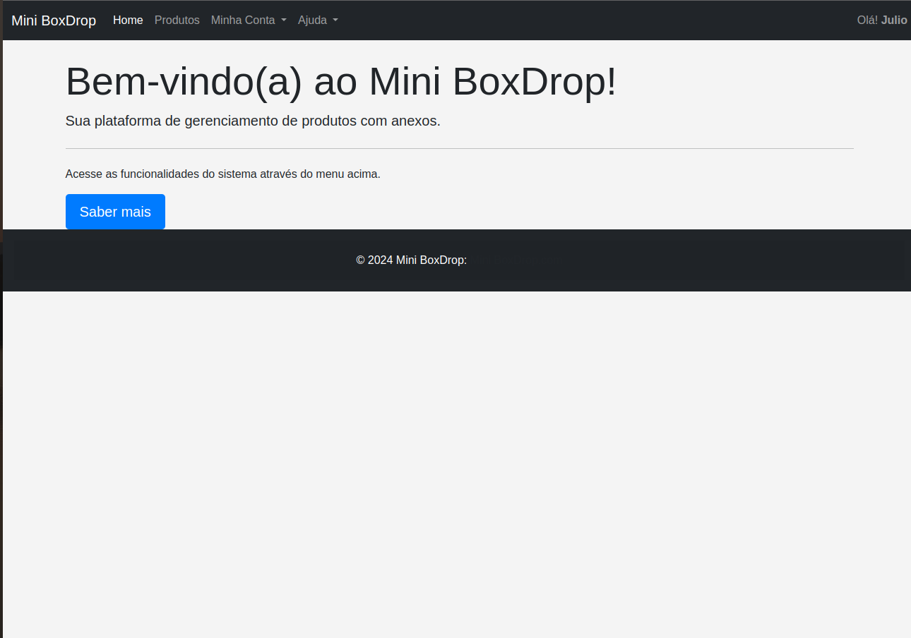
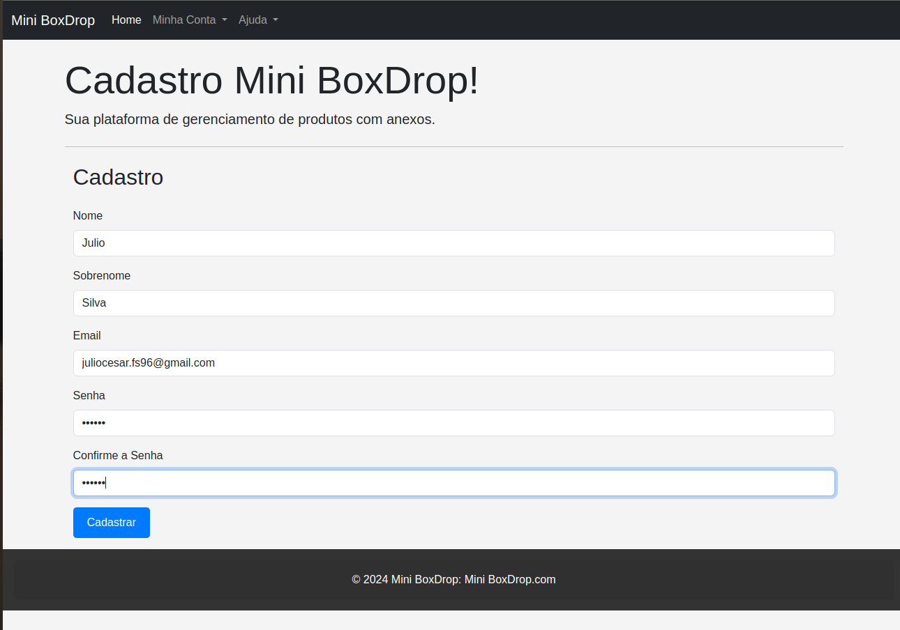
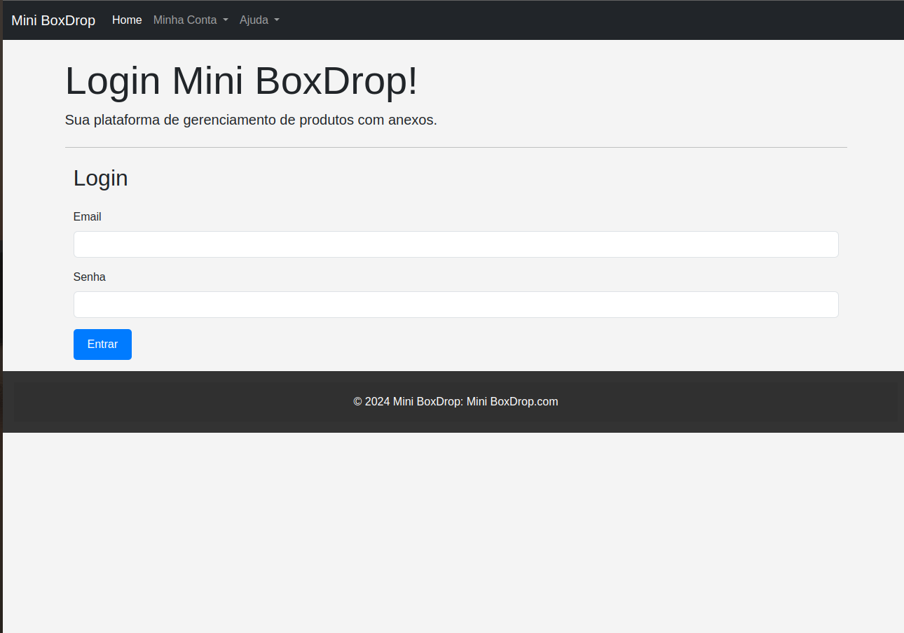
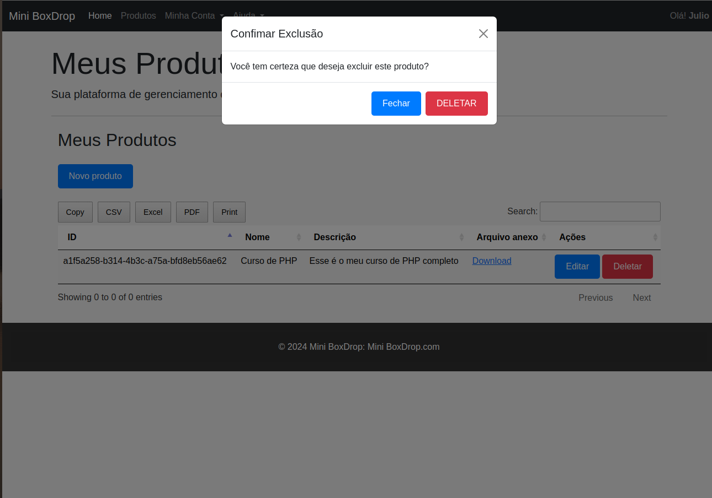
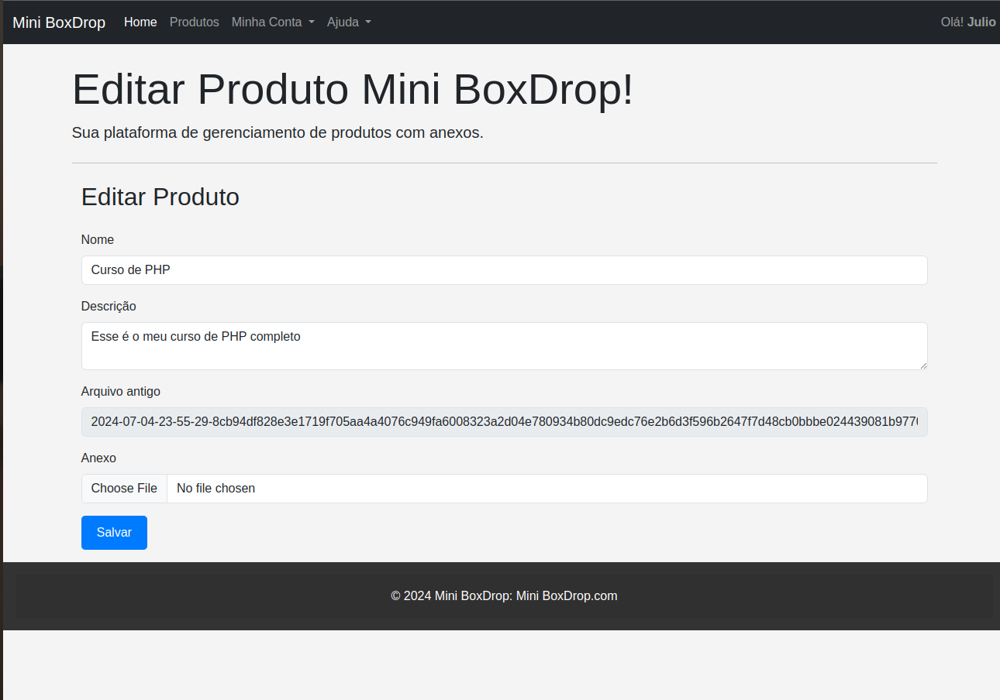
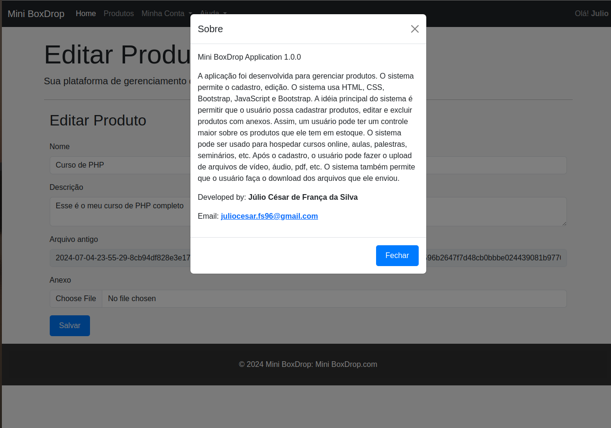

Claro! Aqui está a tradução para o português:

# Mini BoxDrop

## Visão Geral
Mini BoxDrop é um sistema abrangente de gerenciamento de produtos projetado para lidar com as complexidades de gerenciar clientes, produtos e cursos educacionais. Construído com Python usando o framework Flask, ele integra tecnologias como SQLAlchemy para ORM, SQLite para o banco de dados e Bootstrap para design responsivo.

## Funcionalidades
- **Gerenciamento de Clientes**: Registrar, atualizar e excluir clientes.
- **Gerenciamento de Produtos**: Adicionar, editar e remover produtos.
- **Gerenciamento de Cursos**: Organizar e atualizar cursos educacionais.
- **Autenticação de Usuários**: Sistema seguro de login e registro para usuários.
- **Design Responsivo**: Utiliza Bootstrap para garantir uma experiência perfeita em diversos dispositivos.

## Tecnologias
- SQLite
- HTML5
- CSS3
- Bootstrap

## Instalação

### Pré-requisitos
- Navergador Web
- JavaScript habilitado
  
### Configuração
1. Navegue até a pasta do frontend:
   ```sh
   cd  ../frontend
   ```

2. Abra o arquivo `index.html` no seu navegador web.

## Capturas de Tela
|  |  |
|----------------------------------------|----------------------------------------|
|  |  |
|  |  |
|  |  |
|  |  |

## Licença
Distribuído sob a Licença MIT. Veja o arquivo `LICENSE` para mais informações.

## Contato
- Júlio César de França da Silva - juliocesar.fs96@gmail.com

### Descrição das Seções

- **Visão Geral**: Uma breve descrição do projeto e suas funcionalidades.
- **Funcionalidades**: Uma lista das principais funcionalidades do projeto.
- **Tecnologias**: Tecnologias e ferramentas usadas no desenvolvimento do projeto.
- **Instalação**: Instruções passo a passo sobre como configurar o projeto localmente.
- **Uso**: Como usar o projeto após a instalação.
- **Contribuição**: Diretrizes para contribuir com o projeto.
- **Licença**: Informações sobre a licença sob a qual o projeto é distribuído.
- **Contato**: Informações de contato do autor ou mantenedor do projeto.

## Contribuição
Contribuições são o que tornam a comunidade de código aberto um lugar incrível para aprender, inspirar e criar. Qualquer contribuição que você fizer será **muito apreciada**.

1. Faça um Fork do Projeto
2. Crie sua Branch de Funcionalidade (`git checkout -b feature/AmazingFeature`)
3. Commit suas mudanças (`git commit -m 'Add some AmazingFeature'`)
4. Push para a Branch (`git push origin feature/AmazingFeature`)
5. Abra um Pull Request